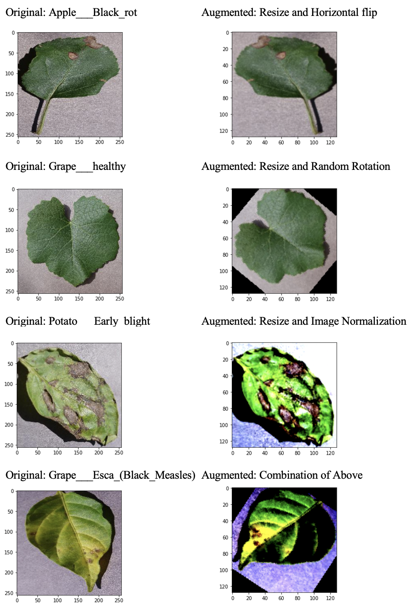
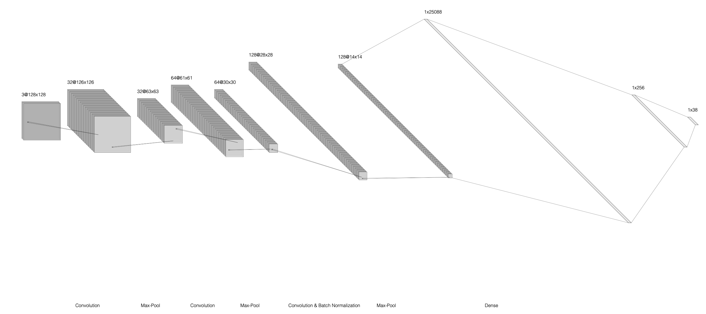
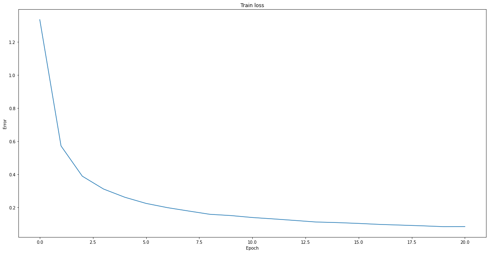
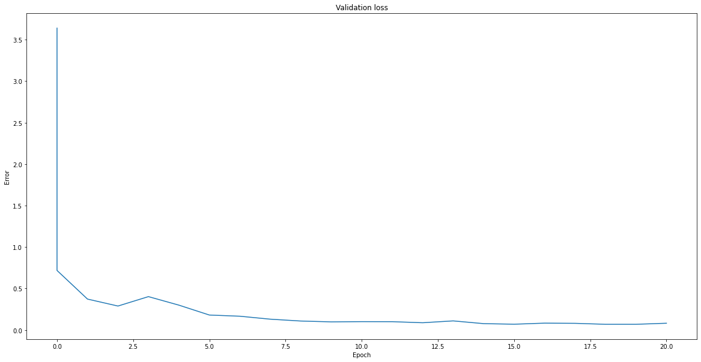
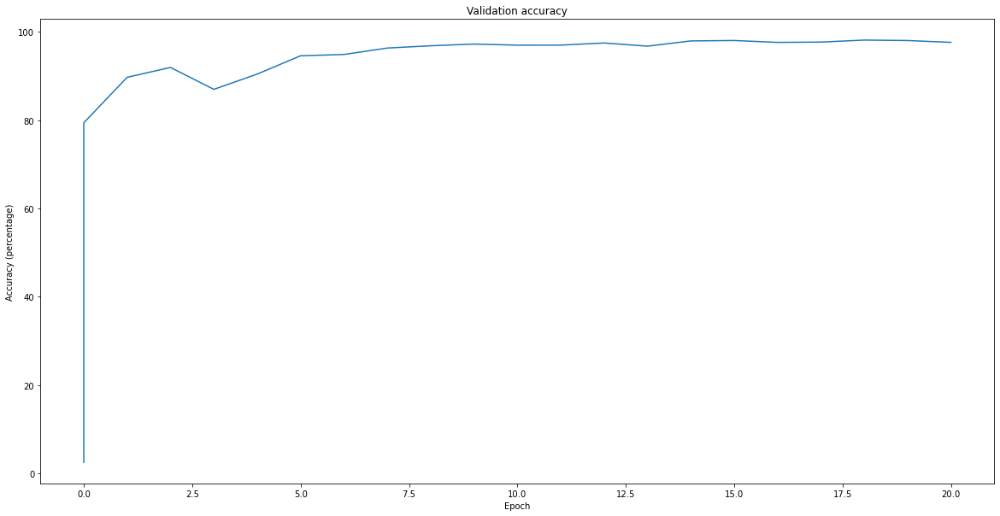
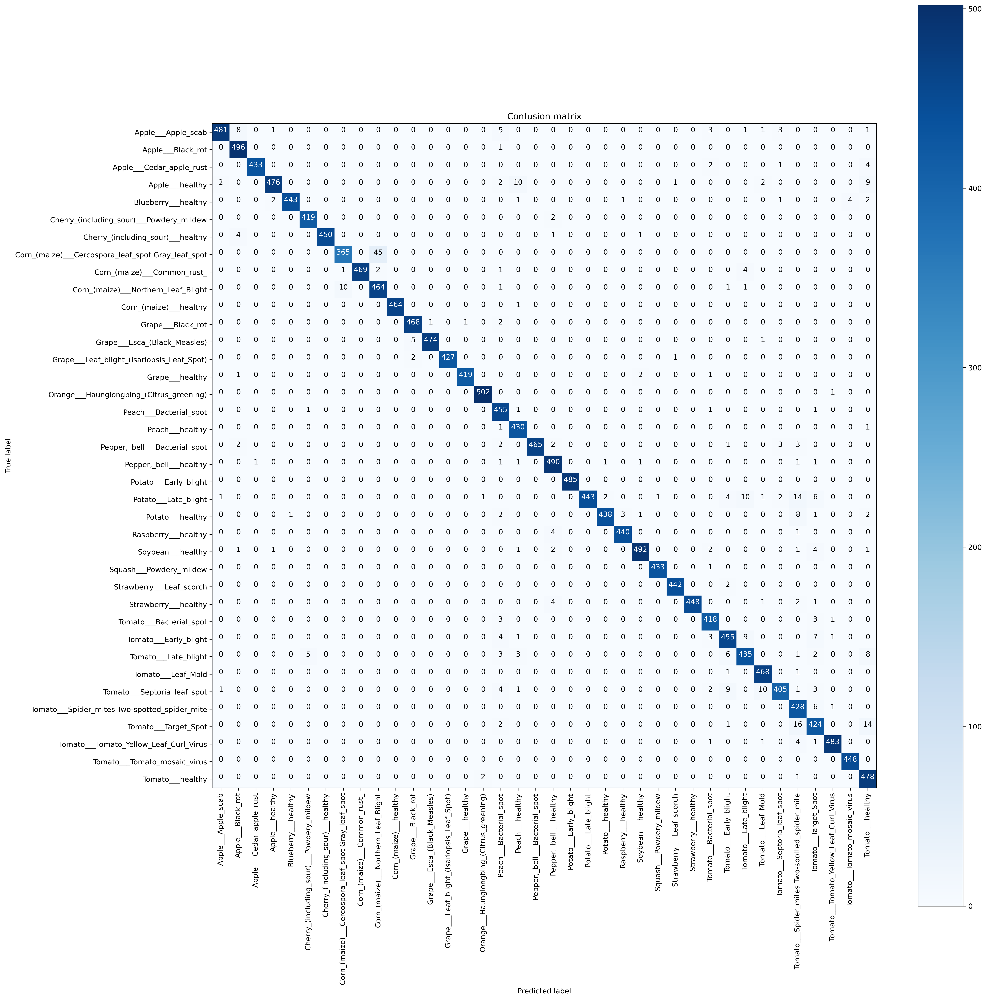
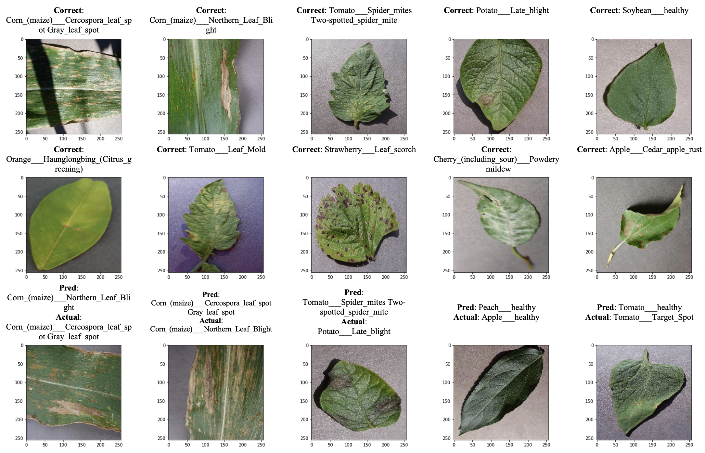

# Leaf Disease Classification

We have created a CNN model to detect healthy and diseased crop leaves, which can be categorized into 38 different classes. We only focus on the leaves of apple, blueberry, cherry, corn, grape, orange, peach, pepper bell, potato, raspberry, soybean, squash, strawberry, and tomato. The training dataset contains 70,295 images, while the validation dataset contains 17,572 images.

Applying image augmentations and using a CNN model with max pooling, batch normalization, and dropout layers to train and predict give us 97.62% accuracy on the validation dataset.

TODO: ADD VIDEO

<!-- Write a 3-4 sentence abstract. It should introduce the problem and your approach. You may also want some numbers like 35 mAP and 78% accuracy. You can use this example README for your project, you can use a different ordering for your website, or you can make a totally different website altogether!

VIDEO GOES HERE (probably): Record a 2-3 minute long video presenting your work. One option - take all your figures/example images/charts that you made for your website and put them in a slide deck, then record the video over zoom or some other recording platform (screen record using Quicktime on Mac OS works well). The video doesn't have to be particularly well produced or anything. -->

## Introduction

Detecting of plant disease early on is crucial in regard to monitoring in big farms of crops, which directly tie to food security. Plant leaves can tell us the symptoms of diseases such as black rot, bacterial spot, leaf mold, and etc. Knowing the disease will give farmers tremendous information on how to treat them to improve the food quality and food production. Hence, we are trying to create a deep learning model detecting plant disease as a tool to make the farmers' jobs run easier and faster.

<!-- In this section the problem you are working on. Maybe talk about why you thought it was interesting. Or why you think it needs to get solved.

You may also want to say a little bit here about what you did. Not too much though. Don't give the whole game away. -->

## Related Work

We have found a [Python notebook](https://www.kaggle.com/vanvalkenberg/cnn-for-plant-disease-detection-92-val-accuracy/notebook) from Ritwek Khosla implementing CNN model to detect the plant disease using the same dataset that we are using. The model yields ~92% accuracy on the validation dataset. In term of the model, he firstly applied a batch normalization layer and then used three convolutional layers with a max pooling layer after each convolutional layer. Then, he flattened the output from those layers and apply two fully connected layers in order to categorize images into a class (among 38 classes).

We believe that the accuracy can be improved by performing data augmentation such as RandomHorizontalFlip, RandomRotation, and ImageNormalization. We also believe that adding more batch normalization layers and a dropout layer will make the model more generalized and perform better on the validation dataset.

<!-- Other people are out there doing things. What did they do? Was it good? Was it bad? Talk about it here. -->

## Dataset

To approach the plant disease problem, we used a [Plant Disease Dataset](https://www.kaggle.com/vipoooool/new-plant-diseases-dataset) from Kaggle by Samir Bhattarai. This dataset has separated images of crop leaves into two dataset–train and validation. Among 38 classes of images, the training dataset contains 70,295 images in total, and the validation dataset contains 17,572 images in total. Below is the breakdown of the dataset:

### Training Dataset

| Class | No. of Images |
| ----- | ------------- |
| Apple___Apple_scab | 2016 |
| Apple___Black_rot | 1987 |
| Apple___Cedar_apple_rust | 1760 |
| Apple___healthy | 2008 |
| Blueberry___healthy | 1816 |
| Cherry_(including_sour)___Powdery_mildew | 1683 |
| Cherry_(including_sour)___healthy | 1826 |
| Corn_(maize)___Cercospora_leaf_spot Gray_leaf_spot | 1642 |
| Corn_(maize)___Common_rust_ | 1907 |
| Corn_(maize)___Northern_Leaf_Blight | 1908 |
| Corn_(maize)___healthy | 1859 |
| Grape___Black_rot | 1888 |
| Grape___Esca_(Black_Measles) | 1920 |
| Grape___Leaf_blight_(Isariopsis_Leaf_Spot) | 1722 |
| Grape___healthy | 1692 |
| Orange___Haunglongbing_(Citrus_greening) | 2010 |
| Peach___Bacterial_spot | 1838 |
| Peach___healthy | 1728 |
| Pepper,_bell___Bacterial_spot | 1913 |
| Pepper,_bell___healthy | 1988 |
| Potato___Early_blight | 1939 |
| Potato___Late_blight | 1939 |
| Potato___healthy | 1824 |
| Raspberry___healthy | 1781 |
| Soybean___healthy | 2022 |
| Squash___Powdery_mildew | 1736 |
| Strawberry___Leaf_scorch | 1774 |
| Strawberry___healthy | 1824 |
| Tomato___Bacterial_spot | 1702 |
| Tomato___Early_blight | 1920 |
| Tomato___Late_blight | 1851 |
| Tomato___Leaf_Mold | 1882 |
| Tomato___Septoria_leaf_spot | 1745 |
| Tomato___Spider_mites Two-spotted_spider_mite | 1741 |
| Tomato___Target_Spot | 1827 |
| Tomato___Tomato_Yellow_Leaf_Curl_Virus | 1961 |
| Tomato___Tomato_mosaic_virus | 1790 |
| Tomato___healthy | 1926 |

### Validation Dataset

| Class | No. of Images |
| ----- | ------------- |
| Apple___Apple_scab | 504 |
| Apple___Black_rot | 497 |
| Apple___Cedar_apple_rust | 440 |
| Apple___healthy | 502 |
| Blueberry___healthy | 454 |
| Cherry_(including_sour)___Powdery_mildew | 421 |
| Cherry_(including_sour)___healthy | 456 |
| Corn_(maize)___Cercospora_leaf_spot Gray_leaf_spot | 410 |
| Corn_(maize)___Common_rust_ | 477 |
| Corn_(maize)___Northern_Leaf_Blight | 477 |
| Corn_(maize)___healthy | 465 |
| Grape___Black_rot | 472 |
| Grape___Esca_(Black_Measles) | 480 |
| Grape___Leaf_blight_(Isariopsis_Leaf_Spot) | 430 |
| Grape___healthy | 423 |
| Orange___Haunglongbing_(Citrus_greening) | 503 |
| Peach___Bacterial_spot | 459 |
| Peach___healthy | 432 |
| Pepper,_bell___Bacterial_spot | 478 |
| Pepper,_bell___healthy | 497 |
| Potato___Early_blight | 485 |
| Potato___Late_blight | 485 |
| Potato___healthy | 456 |
| Raspberry___healthy | 445 |
| Soybean___healthy | 505 |
| Squash___Powdery_mildew | 434 |
| Strawberry___Leaf_scorch | 444 |
| Strawberry___healthy | 456 |
| Tomato___Bacterial_spot | 425 |
| Tomato___Early_blight | 480 |
| Tomato___Late_blight | 463 |
| Tomato___Leaf_Mold | 470 |
| Tomato___Septoria_leaf_spot | 436 |
| Tomato___Spider_mites Two-spotted_spider_mite | 435 |
| Tomato___Target_Spot | 457 |
| Tomato___Tomato_Yellow_Leaf_Curl_Virus | 490 |
| Tomato___Tomato_mosaic_virus | 448 |
| Tomato___healthy | 481 |

To make the model more generalized, we randomly perform image augmentations to the training images before input them into the model, so the model see a more diverse data. Here are examples of how image augmentation is done:

We always resize the image to 128x128, 50% randomly flip a trained image horizontally, rotate a trained image for some degree in [-90, 90], and always normalize a trained image. For the validation dataset, we only perform Image Normalization to each image before input them into the model.

## Network Architecture

We have created a CNN model as similar as what Ritwek Khosla created, such that we used three convolutional layers with max pooling layer after each of them and had two fully connected layers at the end. In addition, we applied batch normalization layers after the third convolutional layer and after the first fully connected layer to make the model learn better. We also added a dropout layer after the first fully connected layer to make the model more generalized. Below is the diagram of our network architecture:

The model's hyperparameters are listed in [train.py](src/train.py)

<!-- How did you decide to solve the problem? What network architecture did you use? What data? Lots of details here about all the things you did. This section describes almost your whole project.

Figures are good here. Maybe you present your network architecture or show some example data points? -->

## Results

The final model yields 97.62% accuracy on the validation dataset. Comparing to the [model]((https://www.kaggle.com/vanvalkenberg/cnn-for-plant-disease-detection-92-val-accuracy/notebook)) from Ritwek Khosla, our model increase the performance by around 5.62%. Below are the charts from training the model:

We can see that the model's validation loss and validation accuracy get quite saturated after being trained for 7 epochs. It seems like our model fits the training dataset well by not being too underfitted nor overfitted.

To get more sense of how good the model performs on each class, we have built a confusion matrix to see the how many times a label is being predicted as. Here is the confusion matrix which true label is on the vertical axis and predicted label is on the horizontal axis:

Since the model performs very well with 97.62% validation accuracy, we can see high heat along the diagonal of the confusion matrix because the label being predicted is correct. Though, there are some classes that are being commonly predicted to some other classes. For example, among 410 images of `Corn_(maize)___Cercospora_leaf_spot Gray_leaf_spot`, 45 images were falsely predicted as `Corn_(maize)___Northern_Leaf_Blight`. We will discuss about this more in the next section.

We have provided examples of 30 images that the model predicted:

<!-- How did you evaluate your approach? How well did you do? What are you comparing to? Maybe you want ablation studies or comparisons of different methods.

You may want some qualitative results and quantitative results. Example images/text/whatever are good. Charts are also good. Maybe loss curves or AUC charts. Whatever makes sense for your evaluation. -->

## Discussion

We can see that applying image augmentations and adding more batch normalization layers and a dropout layer significantly increase the model's performance. We believe that image augmentations will prepare the model for a more diverse data and that batch normalization layers will increase the capacity of how much model can learn, while adding a dropout layer ensures that the model is not being too overfitted to the training dataset.

Based on the results we included above, we would like to propose an idea of possible improvements to why the model falsely predicts `Corn_(maize)___Cercospora_leaf_spot Gray_leaf_spot` to be `Corn_(maize)___Northern_Leaf_Blight` (but not many on aother way around). We could see from the prediction images above that the leaves of these two classes look very similar. Also, we notice that `Corn_(maize)___Cercospora_leaf_spot Gray_leaf_spot` has the least number of images in the training dataset (only 1,642 images) while there are 1,908 images of `Corn_(maize)___Northern_Leaf_Blight`. By learning about `Corn_(maize)___Northern_Leaf_Blight` more, we have made the model become biased towards it. If we could add more images of `Corn_(maize)___Cercospora_leaf_spot Gray_leaf_spot` into the training dataset, we are hopeful that the model will recognize them better and decrease the number of times it falsely predict.
<!-- You can talk about your results and the stuff you've learned here if you want. Or discuss other things. Really whatever you want, it's your project. -->

## Author
This project is created by Louis Maliyam for the final project of the University of Washington CSE599 G1 (Autumn 2020). 
